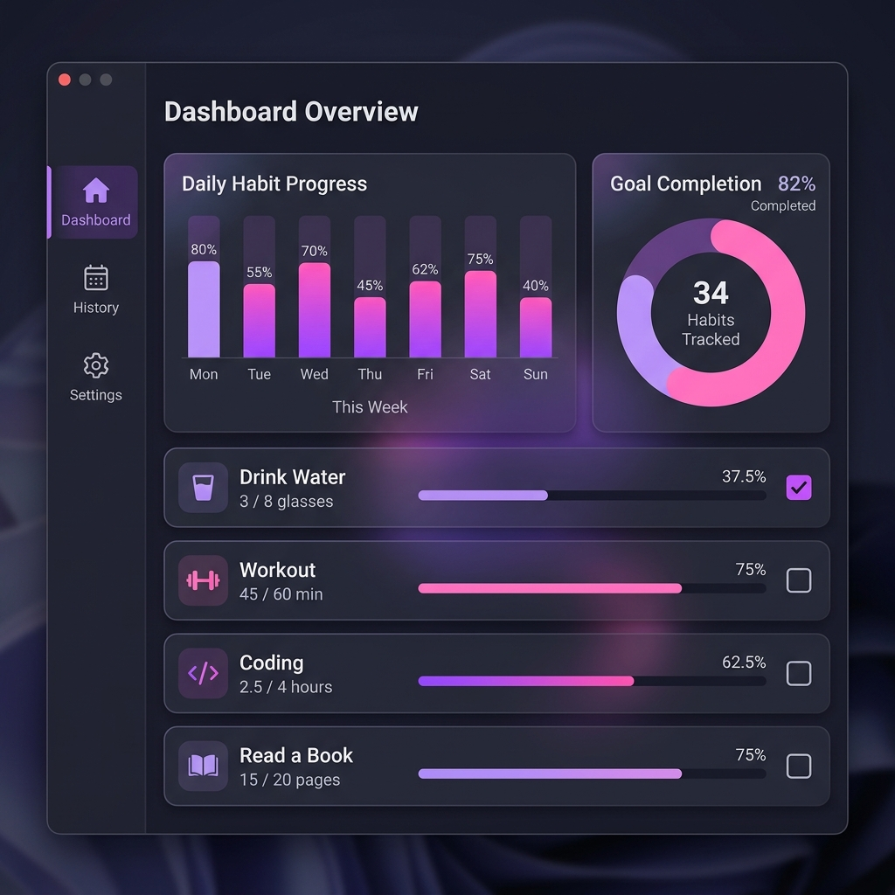

# 🔥 Premium Habit Tracker



## 🌟 Overview
**Habit Tracker** is a sleek, modern, and powerful desktop application designed to help you stay on top of your daily routines and long-term goals. Built with **Python** and **PyQt5**, it features a beautiful **Dracula-themed** interface that makes tracking habits an enjoyable experience.

Whether you're looking to build new habits or break old ones, this tool provides the analytics and visual feedback you need to stay motivated.

---

## 🚀 Key Features

### 📊 Dynamic Dashboard
Get an immediate overview of your progress with interactive charts.
- **Progress Analytics**: View your daily and monthly performance through Horizontal Bar, Vertical Bar, and Pie charts.
- **Interactive Habit List**: Check off habits as you complete them and see your progress bars fill up in real-time.

### 🎯 Versatile Habit Tracking
Support for different types of habits to suit your needs:
- **Daily Targets**: Habits that repeat every day (e.g., "Drink 8 glasses of water").
- **Total Targets**: Habits with a specific goal to reach over time (e.g., "Read 500 pages").

### 🎨 Customizable Themes
Personalize your experience with built-in theme support.
- **Dracula Theme**: A beautiful, high-contrast dark theme by default.
- **Expandable**: Architecture designed to support additional themes easily.

### ⏳ Historical Insights
Look back at your journey with the History page.
- **Monthly Records**: Filter by month and year to see how you performed in the past.
- **Data Persistence**: All your data is safely stored in a local SQLite database.

### ☰ Responsive UI
- **Collapsible Sidebar**: Maximize your workspace by toggling the navigation menu.
- **Sleek Navigation**: Easily switch between Dashboard, History, and Settings.

---

## 🛠️ Tech Stack
- **Language**: Python 3.x
- **GUI Framework**: PyQt5
- **Data Visualization**: Matplotlib
- **Database**: SQLite
- **Styling**: QSS (Qt Style Sheets)

---

## 📥 Installation

1. **Clone the repository**:
   ```bash
   git clone https://github.com/Mo-Yunis/habit-tracker-.git
   cd habit-tracker-
   ```

2. **Create a virtual environment** (optional but recommended):
   ```bash
   python -m venv .venv
   source .venv/bin/activate  # On Windows: .venv\Scripts\activate
   ```

3. **Install dependencies**:
   ```bash
   pip install -r requirements.txt
   ```

4. **Run the application**:
   ```bash
   python main.py
   ```

---

## 💡 How to Use
1. **Add a Habit**: Use the form in the sidebar to create a new habit. Choose between "Daily" or "Total" target.
2. **Track Progress**: On the Dashboard, check the habits you've completed today.
3. **Analyze**: Use the charts at the top to see your completion rates.
4. **History**: Toggle to the History tab to review past months.

---

## 👨‍💻 Credits
Developed with ❤️ by **Yunis**.

> "تم التطوير بواسطه يونس - لاتنسوا والدتي من دعائكم"

---

## 📄 License
This project is licensed under the MIT License - see the LICENSE file for details.
